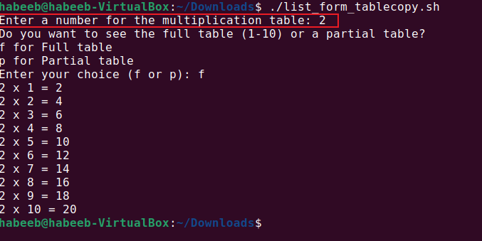
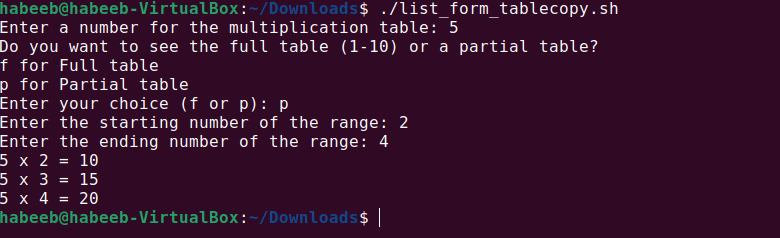
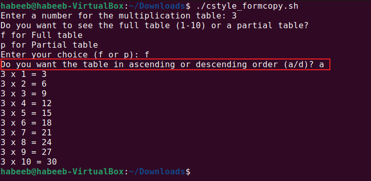

# Capstone Project - Linux Shell Scripting

## Using the List Form for Loop

Using the `List Form` for Loop, this script prompts the user to enter a number and also showing the iteration of the value multiplying 1 through to 10 in a full or partial table.

A partial table displaying the variable entered by the user within a range.

## Using the Cstyle Form for Loop

Using the ``Cstyle Form`` for Loop, the table below displpays the script prompting to either display the table in an ascending or descending order.

